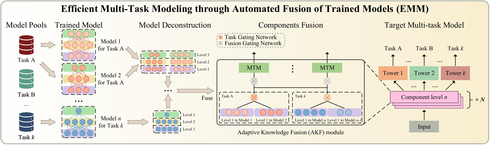

# Efficient Multi-Task Modeling through Automated Fusion of Trained Models

This repository is for EMM method.

## Introduction

Although multi-task learning is widely applied in intelligent services, traditional multi-task modeling methods often require customized designs based on specific task combinations, resulting in a cumbersome modeling process. Inspired by the rapid development and excellent performance of single-task models, this paper proposes an efficient multi-task modeling method that can automatically fuse trained single-task models with different structures and tasks to form a multi-task model.
As a general framework, this method allows modelers to simply prepare trained models for the required tasks, simplifying the modeling process while fully utilizing the knowledge contained in the trained models. This eliminates the need for excessive focus on task relationships and model structure design. To achieve this goal, we consider the structural differences among various trained models and employ model decomposition techniques to hierarchically decompose them into multiple operable model components. Furthermore, we have designed an Adaptive Knowledge Fusion (AKF) module based on Transformer, which adaptively integrates intra-task and inter-task knowledge based on model components.
Through the proposed method, we achieve efficient and automated construction of multi-task models, and its effectiveness is verified through extensive experiments on three datasets.

<div align="center">
  
  Overview of our method.
</div>

## Prerequisites

### Experiment Environment

Our implementation is in Pytorch.
We use `python3.11` and  please refer to [this link](https://docs.conda.io/projects/conda/en/latest/user-guide/tasks/manage-environments.html#creating-an-environment-with-commands) to create a `python3.11` conda environment.
Install the listed packages in the virual environment:

```
pip install torch-rechub
```

### Datasets

A total of three multi-task datasets were used, namely Ali-CCP, AliExpress, and Census-Income.

#### Ali-CCP

This dataset is collected from the recommendation system logs of Taobao’s mobile app. It consists of 23 sparse features and 8 dense features, including two labels: “click” and “purchase”.
The dataset covers information from 250,000 users and 500,000 products, totaling 80 million data entries.

- Notes
  - The original data has already been divided into a training set and a test set. During preprocessing, half of the original test set is randomly allocated as a validation set. The ratio of the preprocessed training set, validation set, and test set is 2:1:1.
  - The sparse features of the preprocessed dataset have undergone Label Encoding, while the dense features have been normalized. We also provide a script named `data\ali-ccp\preprocess_ali_ccp.py` for processing the original data.
- Original data address: [This Link](https://tianchi.aliyun.com/dataset/dataDetail?dataId=408).
- Download address for the preprocessed full dataset: [This Link](https://aistudio.baidu.com/datasetdetail/281072).

#### AliExpress

AliExpress data contains 16 sparse features and 63 dense features, labeled with "exposure", "click", and "conversion". The dense features in the original data have already undergone normalization preprocessing. The original data consists of 5 CSV files, but only the data from the US region is used for testing here.

- Original data address: [This Link](https://tianchi.aliyun.com/dataset/dataDetail?dataId=74690&lang=en-us).
- Download address for the preprocessed full dataset: [This Link](https://aistudio.baidu.com/datasetdetail/321095).

#### Census-Income

This dataset consists of US census income data, which is used to predict income levels (below 50k or above 50k). After preprocessing, it contains a total of 41 columns, including 7 dense features, 33 sparse features, and 1 label column.

- Notes
  - In Experiment of the MMOE paper and in the PLE approach, income prediction is treated as the main task, while marital status prediction serves as an auxiliary task.
  - To consistently test all multitask models, we follow the ESMM setup, where income prediction is considered a CTR (Click-Through Rate) task, and marital status prediction is treated as a CVR (Conversion Rate) task.
  - For reference on how to process the original data, please see `data\census-income\preprocess_census.py`.
- Original data address: [This Link](http://archive.ics.uci.edu/ml/datasets/Census-Income+(KDD)).
- Download address for the preprocessed full dataset: [This Link](https://aistudio.baidu.com/datasetdetail/321097).

## Train Pre-trained Model

To train a single-task pre-trained model as the foundation for model fusion, you can refer to `single_datasetname.ipynb` for experimentation.

## Train Baseline and Our Method

Please refer to the details in `multi_task_datasetname.ipynb` for training both the Baseline model and the model of our proposed method.

In our proposed approach, the multi-task model architecture is created by decomposing four single-task pre-models and then hierarchically fusing them together. This process aligns precisely with the experiments described in the paper. However, the specific steps of decomposition and fusion are not detailed here.

## Acknowledgement
Some dataloading and evaluation code is from:
https://github.com/datawhalechina/torch-rechub
